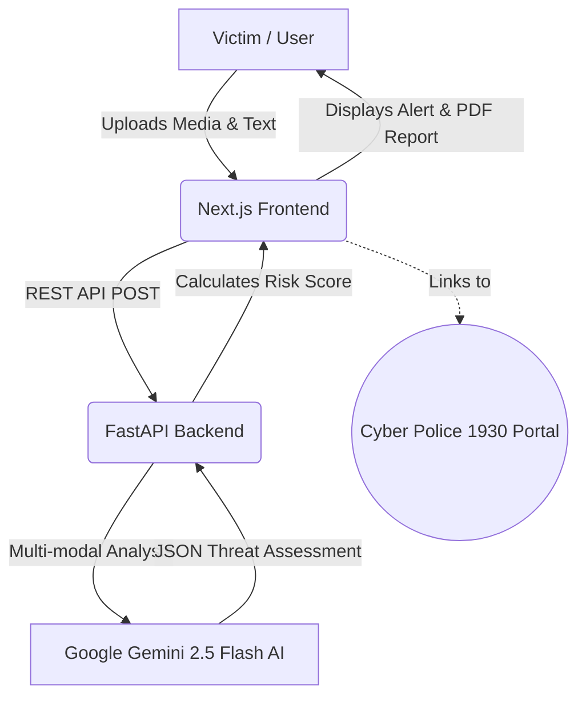

# 🛡️ SENTINEL / RAKSHA

> **Proactive AI Shield against Deepfake Sextortion & Blackmail**


## 📌 The Problem
Deepfake sextortion is rising globally, leaving victims feeling isolated, panicked, and forced to pay ransoms. Victims lack a fast, reliable way to verify if media used to blackmail them is fake, and they struggle to gather evidence to report the crime properly.

## 💡 Our Solution
**RAKSHA** is an AI-powered command center that acts as a first line of defense for victims. By uploading suspicious media and extortion texts, our system uses **Google Gemini 2.5 Flash** to perform multi-modal analysis, instantly detecting AI-generated manipulations and extortion intent. 

It prevents victims from paying ransoms and generates official, print-ready Cyber Crime reports with a single click.

---

## ✨ Key Features
- 🕵️‍♂️ **Multi-Modal Deepfake Detection**: Analyzes both images/videos and associated text messages simultaneously.
- 🚨 **Composite Risk Scoring**: Calculates a definitive 0-100 threat score to guide the victim's immediate actions.
- 🏢 **One-Click Cyber Police Integration**: Generates official evidence reports and links directly to the National Cyber Crime Portal (1930).
- 🔐 **Secure Auth Flow**: Built-in authentication system with simulated OTP flow to ensure user privacy.
- 📊 **Global Threat Analytics**: A dedicated dashboard tracking active interception metrics across the network.

---

## 🏗️ Architecture



---

## 🛠️ Tech Stack
- **Frontend**: Next.js 14, React, Tailwind CSS, TypeScript
- **Backend**: Python, FastAPI, Uvicorn, Pydantic
- **AI / Model**: Google Gemini (`gemini-2.5-flash`) via the `google-genai` SDK

---

## 🚀 Running the Project Locally

### Prerequisites
- Node.js (v18+)
- Python (3.10+)
- Gemini API Key

### 1. Backend Setup (FastAPI)
Navigate to the backend directory and set up the Python environment:
```bash
cd backend
python -m venv venv
# Activate virtual environment
# Windows:
.\venv\Scripts\activate
# Mac/Linux:
source venv/bin/activate

pip install -r requirements.txt
```
Create a `.env` file in the `backend` folder and add your API key:
```env
GEMINI_API_KEY=your_api_key_here
```
Run the server:
```bash
uvicorn main:app --reload
# Runs on http://127.0.0.1:8000
```

### 2. Frontend Setup (Next.js)
Open a new terminal, navigate to the frontend directory:
```bash
cd frontend
npm install
npm run dev
# Runs on http://localhost:3000
```

---

## 🏆 Hackathon Presentation Flow
1. **The Hook**: Explain the rising problem of deepfake sextortion.
2. **The Demo**: Log in with a 10-digit phone number (watch the dynamic UI hide the password field!).
3. **The Core Magic**: Upload a sample image and an extortion text. Run the scanner.
4. **The Impact**: Show the generated report and the 4 immediate action buttons (including the 1930 Helpline link).
5. **The Scale**: Click over to the Global Analytics dashboard to show how this scales nationally.

---
*Built with ❤️ for a safer internet.*
